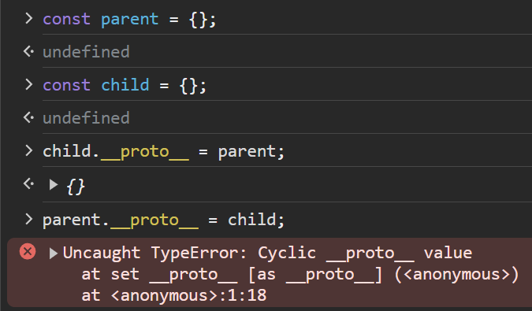

# 모딥다 19장. 프로토타입

자바스크립트는 클래스와 상속과 캡슐화를 위한 `public`, `private` , `protected` 키워드를 제공하지 않기 때문에 객체지향 언어가 아니다라고 흔히 오해를 받지만, 자바스크립트는 프로토타입을 기반의 객체지향 언어이다.
또한 명령형, 함수형, 프로토타입 기반 객체지향 프로그래밍 패러다임을 모두 지원하는 멀티 패러다임 프로그래밍 언어이다.

- 클래스
  자바스크립트의 클래스는 다른 객체지향 언어의 클래스와는 다르다. 자바스크립트의 클래스는 함수이며, 기존 프로토타입 기반 패턴의 문법적 설탕 이라고 볼 수 있다.
  클래스와 생성자 함수는 **프로로타입 기반의 인스턴스를 생성**하는 것은 동일하나, 클래스는 생성자 함수보다 엄격하고, 생성자 함수에서 제공하지 않는 기능을 제공하는 등 동작에는 차이가 있다.

## 19.1 객체지향 프로그래밍

- 객체지향 프로그래밍 : 프로그램을 명령어 또는 함수의 목록으로 보는 전통적인 명령형 프로그래밍 패러다임의 절차지향적 관점에서 벗어나 여러 개의 독립적 단위인 **객체의 집합으로 프로그램을 표현**하려는 프로그래밍 패러다임
- 추상화 : 실제 세계의 어떠한 사물이나 개념이 갖는 다양한 속성 중 구현하려는 프로그램에 필요한 속성만 간추려 내어 표현하는 것
- 객체지향 프로그래밍은 객체의 상태를 나타내는 데이터(프로퍼티)와 상태를 조작할 수 있는 동작(메서드)를 하나의 논리적인 단위로 묶어 생각한다. 따라서 객체는 상태 데이터와 동작을 하나의 논리적인 단위로 묶은 복합적인 자료구조라고 할 수 있다.

## 19.2 상속과 프로토타입

- 상속 : 어떤 객체의 프로퍼티 또는 메서드를 다른 객체가 상속받아 그대로 사용할 수 있는 것 (객체지향 프로그래밍의 가장 큰 특징으로, 불필요한 중복을 제거 가능.)
- 자바스크립트는 프로토타입 기반으로 상속을 구현한다.
- 각 객체들은 자신의 고유한 기능을 수행하면서 다른 객체와 메시지를 주고받거나 데이터를 처리하는 관계성을 가질 수도 있다.
  - 또는 다른 객체의 상태 데이터(프로퍼티)나 동작(메서드)을 상속받아 사용하기도 한다.
- 중복 생성 문제 : 동일한 생성자 함수에 의해 생성된 인스턴스들은 동일한 프로퍼티나 메서드를 중복 소유하여 메모리를 낭비하게 된다.
  - 해결 : 프로토타입 기반의 상속 구현을 통해 내용이 동일한 프로퍼티나 메서드는 인스턴스가 부모 객체의 프로토타입의 자산을 공유하여(상속받아) 사용할 수 있다.

```js
// 메서드 중복 생성 예시
function Circle(radius) {
	this.radius = radius;
	this.getArea = function () {
		return Math.PI * this.radius ** 2; // **: 거듭제곱 연산자(좌항: 밑, 우항: 지수)
	};
}

const circle1 = new Circle(1);
const circle2 = new Circle(2);

console.log(circle1.getArea === circle2.getArea); // false
```

```js
// 상속에 의한 메서드 공유 예시
function Circle(radius) {
	this.radius = radius;
	Circle.prototype.getArea = function () {
		return Math.PI * this.radius ** 2;
	};
}

const circle1 = new Circle(1);
const circle2 = new Circle(2);

console.log(circle1.getArea === circle2.getArea); // true
```

## 19.3 프로토타입 객체

- 프로토타입 객체는 어떤 객체의 상위(부모) 객체의 역할을 하는 객체로서 다른 객체에 공유 프로퍼티를 제공한다.
- 모든 객체는 `[[Prototype]]` 내부 슬롯을 갖는다.
- `[[Prototype]]` 내부 슬롯의 값은 프로토타입의 참조 이거나 `null`이다.
- 객체의 생성 방식에 따라 객체의 `[[Prototype]]` 내부 슬롯에 저장되는 프로토타입이 달라진다.
  - 객체 리터럴에 의해 생성된 객체의 프로토타입은 `Object.prototype`이다. (ex: `obj.__proto__ === Object.prototype; // true`)
  - 생성자 함수에 의해 생성된 객체의 프로토타입은 생성자 함수의 `prototype` 프로퍼티에 바인딩된 객체이다. (ex: `user1.__proto__ === User.prototype; // true`)

```js
// 객체 리터럴에 의해 생성된 객체의 프로토타입은 `Object.prototype`이다.
const obj = {};
obj.__proto__ === Object.prototype; // true
Object.prototype; // {constructor: ƒ, __defineGetter__: ƒ, __defineSetter__: ƒ, hasOwnProperty: ƒ, __lookupGetter__: ƒ, …}
obj.__proto__; // {constructor: ƒ, __defineGetter__: ƒ, __defineSetter__: ƒ, hasOwnProperty: ƒ, __lookupGetter__: ƒ, …}

// 생성자 함수에 의해 생성된 객체의 프로토타입은 생성자 함수의 `prototype` 프로퍼티에 바인딩된 객체이다.
function User(name) {
	this.name = name;
}
const user1 = new User('kim');
user1.__proto__ === User.prototype; // true
User.prototype; // {constructor: ƒ}
user1.__proto__; // {constructor: ƒ}
```

모든 객체는 하나의 프로토타입을 갖는다. 그리고 모든 프로토타입은 생성자 함수와 연결되어 있다.
즉 객체와 프로토타입과 생성자 함수는 서로 연결되어 있다. (아래 예제 참고)

- `[[Prototype]]` 내부 슬롯의 값은 프로토타입의 참조 이거나 `null`이다.
- `__proto__` 접근자 프로퍼티를 통해 `[[Prototype]]` 내부 슬롯의 값, 즉 자신의 프로토타입에 접근할 수 있다.
- 프로토타입은 자신의 `constructor` 프로퍼티를 통해 생성자 함수에 접근할 수 있다.
- 생성자 함수는 자신의 `prototype` 프로퍼티를 통해 프로토타입에 접근할 수 있다.

```js
// 생성자 함수
function Person(name) {
	this.name = name;
}

// 생성자 함수 Person에 의해 생성된 객체는 Person.prototype을 자신의 프로토타입으로 갖는다.
const me = new Person('Kim');
console.log(Person.prototype === me.__proto__); // true

// 모든 프로토타입은 constructor 프로퍼티를 가지고 있으며 이는 프로토타입의 생성자 함수를 가리킨다.
console.log(Person.prototype.constructor === Person); // true
console.log(me.__proto__.constructor === Person); // true

// 프로토타입 상속
Person.prototype.sayHi = function () {
	console.log(`Hi! My name is ${this.name}`);
};

me.sayHi(); // Hi! My name is Kim
Object.getOwnPropertyDescriptors(me); // {name: {…}}
```

위 예제를 통해 객체와 그 객체의 프로토타입, 그리고 생성자 함수는 서로 연결되어 있음을 알 수 있다. 이 연결이 자바스크립트 상속 메커니즘의 기반이 되며, 객체가 자신의 프로토타입의 프로퍼티와 메서드를 상속받는 방식으로 작동한다. (프로토타입은 어떤 객체의 상위(부모) 객체의 역할을 하는 객체를 뜻하고 다른 객체에 공유 프로퍼티를 제공할 수 있기 때문에.)

### 19.3.1 `__proto__` 접근자 프로퍼티

```js
function Person(name) {
	this.name = name;
}

console.log(Person.__proto__); // ƒ () { [native code] }

const obj = {};
console.log(obj.__proto__); // {constructor: ƒ, __defineGetter__: ƒ, __defineSetter__: ƒ, hasOwnProperty: ƒ, __lookupGetter__: ƒ, …}

// 함수는 Function 객체를 상속받고 일반 객체는 Object 객체를 상속받는다.
console.log(Person.__proto__ === Function.prototype); // true
console.log(obj.__proto__ === Object.prototype); // true
```

모든 객체는 `__proto__` 접근자 프로퍼티를 통해 자신의 프로토타입, 즉 `[[Prototype]]` 내부 슬롯의 값에 간접적으로 접근할 수 있다.

#### `__proto__` 는 접근자 프로퍼티다.

- 즉 자체적으로 값(프로퍼티 어트리뷰트)을 갖지 않고 다른 데이터 프로퍼티의 값을 읽거나 저장할 때 사용하는 접근자 함수(`[[Get]], [[Set]]` 프로퍼티 어트리뷰트)로 구성된 프로퍼티다.

#### `__proto__` 접근자 프로퍼티는 상속을 통해 사용한다.

- `__proto__` 접근자 프로퍼티는 `Object.prototype`의 접근자 프로퍼티다.
- 모든 객체는 `Object.prototype`의 접근자 프로퍼티인 `__proto__`를 상속받아 사용할 수 있다.
- `__proto__` 접근자 프로퍼티는 객체가 직접 소유하는 프로퍼티가 아니라 `Object.prototype`의 프로퍼티다.

#### `__proto__` 접근자 프로퍼티를 통해 프로토타입에 접근하는 이유


상호 참조에 의해 프로토타입 체인이 생성되는 것(부모와 자식이 서로의 프로토타입이 되는 순환 참조 무한루프)을 방지하기 위해 `__proto__` 접근자 프로퍼티를 통해 프로토타입에 접근한다.
프로토타입 체인은 검색 방향이 한쪽 방향으로만 흘러가는 단방향 링크드 리스트로 구현되어야 한다. 따라서 아무런 체크 없이 프로토타입을 교체할 수 없도록 `__proto__` 접근자 프로퍼티를 통해 프로토타입에 접근하고 교체하도록 구현되어 있다.

#### `__proto__` 접근자 프로퍼티를 코드 내에서 직접 사용하는 것은 권장하지 않는다.

모든 객체가 `__proto__` 접근자 프로퍼티를 사용할수 있는 것은 아니기 때문이다.
직접 상속을 통해 생성되어 `Object.prototype` 을 상속받지 않는 객체는 `__proto__` 접근자 프로퍼티를 사용할 수 없다.
따라서 프로토타입 참조 시 `Object.getPrototypeOf` 메서드, 프로토타입 교체 시 `Object.setPrototypeOf` 메서드를 사용하는 것이 권장된다.

### 19.3.2 함수 객체의 `prototype` 프로퍼티

(생성자 함수로 호출할 수 있는)함수 객체만이 소유하는 `prototype` 프로퍼티는 생성자 함수가 생성할 **인스턴스의 프로토타입**을 가리킨다.

```js
function Person(name) {
	this.name = name;
}

const p1 = new Person('Kim');

Person.prototype === Object.getPrototypeOf(p1); // true
Person.prototype === p1.__proto__; // true
p1.__proto__ === Object.getPrototypeOf(p1); // true
```

일반 객체는 `prototype` 프로퍼티를 소유하지 않는다.

```js
(function () {}).hasOwnProperty('prototype'); // true
({}).hasOwnProperty('prototype'); // false
[].hasOwnProperty('prototype'); // false
```

`non-constructor`인 화살표 함수와 ES6 메서드 축약 표현으로 정의한 메서드는 `prototype` 프로퍼티를 소유하지 않는다. 또한 프로토타입도 생성하지 않는다.
`prototype` 프로퍼티는 생성자 함수가 생성할 인스턴스의 프로토타입을 가리키는데, 화살표 함수와 ES6 메서드 축약 표현으로 정의한 메서드는 생성자 함수로 호출할 수 없다. 따라서 인스턴스를 생성할 수 없으므로 프로토타입도 생성하지 않는다.

```js
// 화살표 함수
const Car = (brand) => {
	this.brand = brand;
};
Car.hasOwnProperty('prototype'); // false
Car.prototype; // undefined

// ES6 메서드 축약 표현
const obj = {
	foo() {},
};

obj.foo.hasOwnProperty('prototype'); // false
obj.foo.prototype; // undefined
```

### 19.3.3 프로토타입의 `constructor` 프로퍼티와 생성자 함수

- 모든 프로토타입은 `constructor` 프로퍼티를 갖는다.
- 프로토타입은 자신의 `constructor` 프로퍼티를 통해 생성자 함수에 접근할 수 있다.
- `constructor` 프로퍼티는 `prototype` 프로퍼티로 자신을 참조하고 있는 생성자 함수를 가리킨다. 이 연결은 생성자 함수 객체가 생성될 때 이뤄진다.
  - `me.constructor === Person; // true`
  - `Person.prototype.constructor === Person; // true`
  - `Person.constructor === Function; // true`
- 생성자 함수의 `prototype` 프로퍼티는 자신이 생성할 인스턴스의 프로토타입을 가리킨다.
  - `Person.prototype === me.__proto__; // true`

```js
function Person(name) {
	this.name = name;
}

const me = new Person('Kim');

// 프로토타입은 자신의 constructor 프로퍼티를 통해 생성자 함수에 접근할 수 있다.
me.__proto__.constructor === Person; // true

// 생성자 함수의 prototype 프로퍼티는 자신이 생성할 인스턴스의 프로토타입을 가리킨다.
Person.prototype === me.__proto__; // true

// constructor 프로퍼티는 prototype 프로퍼티로 자신을 참조하고 있는 생성자 함수를 가리킨다.
Person.prototype.constructor === Person; // true
Person.constructor === Function; // true

// me 객체에는 constructor 프로퍼티가 없지만
// me 객체의 프로토타입인 Person.prototype 객체에는 constructor 프로퍼티가 있다.
// 따라서 me 객체는 Person.prototype 객체의 constructor 프로퍼티를 상속받아 사용할 수 있다.
me.constructor === Person; // true
```

## 19.4 리터럴 표기법에 의해 생성된 객체의 생성자 함수와 프로토타입

앞서 살펴본 것 처럼 생성자 함수에 의해 생성된 인스턴스는 프로토타입의 `constructor` 프로퍼티에 의해 생성자 함수와 연결되고, `constructor` 프로퍼티는 인스턴스를 생성한 생성자 함수를 가리킨다.

```js
function Person(name) {
	this.name = name;
}
const me = new Person('Kim');
me.constructor === Person; // true
```

하지만 객체 리터럴에 의해 생성된 객체의 경우 프로토타입의 `constructor` 프로퍼티가 가리키는 생성자 함수라고 단정할 수는 없다. `Object` 생성자 함수 호출과 객체 리터럴의 평가는 추상 연산 OrdinaryObjectCreate를 호출하여 빈 객체를 생성하는 것은 동일하지만 `new.target`의 확인이나 프로퍼티 추가의 처리 등 세부 내용이 다르다. 객체 리터럴에 의해 생성된 객체는 `Object` 생성자 함수와 연결되어 있지만 `Object` 생성자 함수가 생성한 것은 아니다.
하지만, 리터럴 표기법에 의해 생성된 객체도 상속을 위해 프로토타입이 필요하기 때문에 리터럴 표기법에 의해 생성된 객체도 **가상적인 생성자 함수를 갖는다.** 프로토타입은 생성자 함수와 더불어 생성되며, `prototype`, `constructor` 프로퍼티에 의해 연결되어 있기 때문이다.
즉 프로토타입과 생성자 함수는 단독으로 존재할 수 없고 언제나 쌍으로 존재한다.

- 객체 리터럴
  - 생성자 함수 : `Object`
  - 프로토타입 : `Object.prototype`
- 함수 리터럴
  - 생성자 함수 : `Function`
  - 프로토타입 : `Function.prototype`
- 배열 리터럴
  - 생성자 함수 : `Array`
  - 프로토타입 : `Array.prototype`
- 정규 표현식 리터럴
  - 생성자 함수 : `RegExp`
  - 프로토타입 : `RegExp.prototype`

## 19.5 프로토타입의 생성 시점

프로토타입은 생성자 함수가 생성되는 시점에 더불어 생성된다.
사용자가 정의한 생성자 함수와 빌트인 생성자 함수의 생성자 함수 객체가 생성되는 시점이 다름에 유의하자.

사용자 정의 생성자 함수는 자신이 평가되어 함수 객체로 생성되는 시점에 프로토타입도 더불어 생성되며, 생성된 프로토타입의 프로토타입은 언제나 `Object.prototype`이다.

```js
function Person(name) {
	this.name = name;
}
Person.prototype.__proto__ === Object.prototype; // true
```

모든 빌트인 생성자 함수는 전역 객체가 생성되는 지점에 생성되며, 이 때 더불어 생성된 프로토타입은 빌트인 생성자 함수의 `prototype` 프로퍼티에 바인딩된다.

```js
// 브라우저 환경에서 실행
// 빌트인 객체인 Object는 전역 객체 window의 프로퍼티다.
window.Object === Object; // true
```

사용자 정의 생성자 함수는 런타임 이전 소스코드 평가 과정에서 함수 정의가 평가되어 함수 객체가 될 때 프로토타입도 더불어 생성된다.
빌트인 생성자 함수는 런타임 이전 JS 엔진에 의해 전역 객체가 생성되는 시점에 더불어 생성된다. 빌트인 생성자 함수도 일반 함수처럼 빌트인 생성자 함수가 생성되는 시점에 프로토타입이 생성되며, 생성된 프로토타입은 빌트인 생성자 함수의 `prototype` 프로퍼티에 바인딩된다.

즉 어떤 생성자 함수이건 간에 객체가 생성되기 이전에 생성자 함수와 프로토타입은 이미 객체화되어 존재한다. 런타임 이전에 해당 프로토타입 객체가 메모리에 준비되어 있다는 의미이다.
이렇게 준비된 프로토타입은 이후 생성자 함수 또는 리터럴 표기법으로 객체를 생성하면 생성된 객체의 `[[Prototype]]` 내부 슬롯에 할당된다. 이로써 생성된 객체는 프로토타입을 상속받아 공통으로 사용할 프로퍼티나 메서드를 사용할 수 있게 된다.

## 19.6 객체 생성 방식과 프로토타입의 결정

객체는 객체 리터럴, Object 생성자 함수, 생성자 함수, Object.create 메서드, ES6 클래스 등 다양한 셍성 방법이 있는데, 세부적인 차이는 있지만 생성되는 객체는 모두 추상 연산 OrdinaryObjectCreate에 의해 생성된다.

- 추상 연산 OrdinaryObjectCreate는 필수로 자신이 생성할 객체의 프로토타입을 인수로 전달받는다.
- 추상 연산 OrdinaryObjectCreate 동작과정
  1.  빈 객체를 생성한다.
  2.  객체에 추가할 프로퍼티 목록이 인수로 전달된 경우 프로퍼티를 객체에 추가한다.
  3.  인수로 전달받은 프로토타입을 객체의 `[[Prototype]]` 내부 슬롯에 할당한다.
- 결국 프로토타입은 추상 연산 OrdinaryObjectCreate에 전달되는 인수에 의해 결정되며, 이 인수는 객체가 생성되는 시점에 객체 생성 방식에 의해 결정되는 것이다.
  - 객체 리터럴에 의해 생성된 객체의 프로토타입은 `Object.prototype`이다.
  - Object 생성자 함수에 의해 생성된 객체의 프로토타입은 `Object.prototype`이다.
  - 생성자 함수에 의해 생성된 객체의 프로토타입은 생성자 함수의 `prototype` 프로퍼티에 바인딩된 객체이다.

### 19.6.1 객체 리터럴에 의해 생성된 객체의 프로토타입

- JS 엔진은 객체 리터럴을 평가하여 객체를 생성할 때 `Object.prototype`을 추상 연산 OrdinaryObjectCreate의 인수로 전달한다.
- 따라서 객체 리터럴에 의해 생성된 객체의 프로토타입은 `Object.prototype`이다.
- 객체 리터럴에 의해 생성된 객체는 `constructor` 프로퍼티나 `hasOwnProperty` 메서드 등을 소유하지 않지만, `Object.prototype` 객체가 소유한 프로퍼티와 메서드를 상속받아 사용할 수 있다.

```js
const obj = { x: 1 };
obj.constructor === Object; // true
obj.hasOwnProperty('x'); // true
```

### 19.6.2 Object 생성자 함수에 의해 생성된 객체의 프로토타입

- JS 엔진은 Object 생성자 함수를 호출하여 객체를 생성할 때 `Object.prototype`을 추상 연산 OrdinaryObjectCreate의 인수로 전달한다.
- 따라서 Object 생성자 함수에 의해 생성된 객체의 프로토타입은 `Object.prototype`이다.

### 19.6.3 생성자 함수에 의해 생성된 객체의 프로토타입

- JS 엔진은 `new` 연산자와 함께 생성자 함수를 호출하여 객체를 생성할 때 생성자 함수의 prototype 프로퍼티에 바인딩된 객체를 추상 연산 OrdinaryObjectCreate의 인수로 전달한다.
- 따라서 생성자 함수에 의해 생성된 객체의 프로토타입은 생성자 함수의 `prototype` 프로퍼티에 바인딩된 객체이다.
- `Object` 생성자 함수와 더불어 생성된 프로토타입 `Object.prototype`은 `hasOwnProperty` 등 다양한 빌트인 메서드를 갖고 있지만, 사용자 정의 생성자 함수와 더불어 생성된 프로토타입 (ex: `Person.prototype`)의 프로퍼티는 `constructor` 프로퍼티 하나뿐이다.

## 19.7 프로토타입 체인

- 프로토타입 체인 : 자바스크립트는 객체의 프로퍼티(메서드 포함)에 접근하려고 할 때 해당 객체에 접근하려는 프로퍼티가 없다면 `[[Prototype]]` 내부 슬롯의 참조를 따라 자신의 부모 역할을 하는 프로토타입의 `[[Prototype]]` 내부 슬롯의 참조를 따라 자신의 부모 역할을 하는 프로토타입의 프로퍼티를 순차적으로 검색한다. 이를 프로토타입 체인이라 한다.

### 프로로타입 체인과 스코프 체인의 관계

프로토타입 체인은 상속과 프로퍼티 검색을 위한 매커니즘이며, 스코프 체인은 식별자 검색을 위한 매커니즘이다. 스코프 체인과 프로토타입 체인은 서로 연관없이 별도로 동작하는 것이 아니라 서로 협력하여 식별자와 프로퍼티를 검색하는 데 사용된다.
예를 들어, 어떠한 객체의 특정 프로퍼티의 존재 여부를 확인하기 위해 `hasOwnProperty` 메서드를 호출하는 경우 우선 스코프 체인에서 해당 객체의 식별자를 검색한 다음, 해당 객체의 프로토타입 체인에서 hasOwnPropery 메서드를 검색한다.

```jsx
// 먼저 스코프 체인에서 me 식별자를 검색한다.
// me 식별자를 스코프 체인에서 찾으면 me 객체의 프로토타입 체인에서
// hasOwnProperty 메서드를 검색한다.
me.hasOwnProperty('name');
```

## 19.8 오버라이딩과 프로퍼티 섀도잉

- 오버라이딩 : 상위 클래스가 가지고 있는 메서드를 하위 클래스가 재정의하여 사용하는 것
- 프로퍼티 섀도잉 : 상속 관계에 의해 프로퍼티가 가려지는 현상
- 하위 객체를 통해 프로토타입의 프로퍼티를 변경 또는 삭제하는 것은 불가능하다.
- 프로토타입 프로퍼티를 변경 또는 삭제하려면 하위 객체를 통해 프로토타입 체인으로 접근하는 것이 아니라 프로토타입에 직접 접근해야 한다.

## 19.9 프로토타입의 교체

프로토타입은 생성자 함수 또는 인스턴스에 의해 임의의 다른 객체로 교체할 수 있다. 즉 부모 객체인 프로토타입을 동적으로 변경할 수 있기 때문에 이러한 특징을 활용하여 객체 간의 상속 관계를 동적으로 변경할 수 있다.

### 19.9.1 생성자 함수에 의한 프로토타입의 교체

### 19.9.2 인스턴스에 의한 프로토타입의 교체

## 19.10 instanceof 연산자

- instanceof 연산자
  - 용례 : `객체 instanceof 생성자 함수`
  - 좌변 : 객체를 가리키는 식별자
  - 우변 : 생성자 함수를 가리키는 식별자
  - 우변의 피연산자가 함수가 아닌 경우 TypeError가 발생한다.
  - 반환값 : 우변의 생성자 함수의 prototype 프로퍼티에 바인딩된 객체가 좌변의 객체의 프로토타입 체인 상에 존재 하는지 유무의 불리언값

instanceof 연산자는 해당 객체와 생성자 함수간의 직접적인 연결을 찾는 것이 아니라(프로토타입의 constructor 프로퍼티가 가리키는 생성자 함수를 찾는 것이 아니라) 객체의 프로토타입 체인을 따라가며 우변의 생성자 함수의 `prototype` 프로퍼티에 바인딩된 객체가 좌변의 객체의 프로토타입 체인 상에 존재하는지 확인하는 것임을 유의해야 한다.

### instanceof 연산자의 동작과정

#### 1. 좌변 피연산자 객체의 프로토타입 체인 탐색

좌변 피연산자인 객체의 프로토타입 체인을 탐색한다. 이 프로토타입 체인은 객체의 `[[Prototype]]` 내부 슬롯을 통해 상위 프로토타입으로 연결된다.

#### 2. 우변 피연산자 함수의 prototype 프로퍼티 비교

우변 피연산자 함수의 prototype 프로퍼티에 바인딩된 객체를 확인한다.

#### 3. 프로토타입 체인 상의 존재 여부 확인

좌변 피연산자인 객체의 프로토타입 체인을 따라가며 우변 피연산자인 함수의 prototype 프로퍼티에 바인딩된 객체가 존재하는지 확인한다.
만약 존재하면 true를 반환하고 존재하지 않는다면 프로토타입의 종점에 도달할 때 까지 상위 프로토타입으로 이동하며 존재 여부를 확인한다.

#### 4. 프로토타입 체인의 종점

프로토타입 체인의 최상위에 위치하는 프로로타입 체인의 종점이 되는 객체는 언제나 `Object.prototype` 이다. `Object.prototype` 의 프로토타입(`Object.getPrototypeOf(Object.prototype)`), 즉 `[[Prototype]]` 내부 슬롯의 값은 `null` 이므로, 더이상 상위 프로토타입으로 이동하여 탐색 할 수 없으므로 존재하지 않는 경우로 평가되어 `false` 가 반환된다.

```js
function Person(name) {
	this.name = name;
}

const me = new Person('Kim');

console.log(me.constructor === Person); // true

const parent = {};

// 프로토타입의 교체
Object.setPrototypeOf(me, parent);

// Person 생성자 함수와 parent 객체는 연결되어 있지 않다.
console.log(Person.prototype === parent); // false
console.log(parent.constructor === Person); // false

// 프로토타입이 교체되어 프로토타입과 생성자 함수 간의 연결이 파괴되었다.
console.log(me.constructor === Person); // false
console.log(me.constructor === Object); // true
// me 객체는 Person 생성자 함수의 인스턴스가 분명하나 프로토타입이 교체되어 false로 평가된다.
console.log(me instanceof Person); // false
console.log(me instanceof Object); // true
```

위 예제에서 `me instanceof Person`의 경우 `me` 객체의 프로토타입 체인 상에서 `Person.prototype`에 바인딩된 객체가 존재하는지 확인한다. 예제의 경우 `parent` 객체로 프로토타입을 교체하였기 때문에 `me` 객체는 `parent` 객체와 그 프로토타입 체인을 따르게 되므로, `Person.prototype`에 바인딩된 객체가 `me` 객체의 프로토타입 체인 상에 존재하지 않는다. 따라서 `me instanceof Person`은 `false`로 평가된다.

```js
// instanceof 연산자의 동작과정을 흉내낸 함수를 통해 동작과정 이해하기
// instanceof 연산자는 프로토타입의 constructor 프로퍼티가 가리키는 생성자 함수를 찾는 게 아니라
// 생성자 함수의 prototype 프로퍼티에 바인딩된 객체가 프로토타입 체인 상에 존재하는지 확인하는 것이다.

/** 예시용 생성자 함수 */
const Person = (function () {
	function Person(name) {
		this.name = name;
	}

	// 생성자 함수의 prototype 프로퍼티를 통해 프로토타입 교체
	Person.prototype = {
		sayHello() {
			console.log(`Hi! My name is ${this.name}`);
		},
	};

	return Person;
})();

/** 예시용 인스턴스 */
const me = new Person('Kim');

// instanceof 연산자의 동작을 흉내낸 함수
function isInstanceof(instance, constructor) {
	// 프로토타입 취득
	const prototype = Object.getPrototypeOf(instance);

	// 재귀 탈출 조건
	// prototype이 null이면 프로토타입 체인의 종점에 다다른 것이다.
	if (prototype === null) return false;

	// 프로토타입이 생성자 함수의 prototype 프로퍼티에 바인딩된 객체라면 true를 반환한다.
	// 아니라면 재귀 호출로 프로토타입 체인 상의 상위 프로토타입으로 이동하여 확인한다.
	return (
		prototype === constructor.prototype || isInstanceof(prototype, constructor)
	);
}

// constructor 프로퍼티와 생성자 함수 간의 연결이 파괴되어도 instanceof 연산자는 영향 X
console.log(me.constructor === Person); // false

// Person.prototype이 me 객체의 프로토타입 체인 상에 존재하므로 true를 반환한다.
console.log(isInstanceof(me, Person)); // true
// Object.prototype이 me 객체의 프로토타입 체인 상에 존재하므로 true를 반환한다.
console.log(isInstanceof(me, Object)); // true
```

## 19.11 직접 상속

### 19.11.1 Object.create에 의한 직접 상속

- `Object.create` 메서드
  - 동작 : 명시적으로 프로토타입을 지정하여 새로운 객체를 생성한다.
  - 다른 객체 생성 방식과 마찬가지로 추상 연산 OrdinaryObjectCreate를 호출하여 객체를 생성한다.
  - 첫번째 매개변수 : 생성할 객체의 프로토타입
  - 두번째 매개변수 : 생성할 객체의 프로퍼티 키와 프로퍼티 디스크립터 객체
  - 장점
    - new 연산자 없이도 객체를 생성할 수 있다.
    - 프로토타입을 지정하면서 객체를 생성할 수 있다.
    - 객체 리터럴에 의해 생성된 객체도 상속받을 수 있다.
  - 단점
    - 두번째 인자(매개변수)로 프로퍼티를 정의하는 것이 번거로움.
    - 일단 객체를 생성한 이후 프로퍼티를 추가하는 방법도 있지만 깔끔하지 않음.

```js
/**
 *  지정된 프로토타입 및 프로퍼티를 갖는 새로운 객체를 생성하여 반환한다.
 * @param {Object} prototype - 생성할 객체의 프로토타입으로 지정할 객체
 * @param {Object} [propertiesObject] - 생성할 객체의 프로퍼티를 갖는 객체
 * @returns {Object} 지정된 프로토타입 및 프로퍼티를 갖는 새로운 객체
 */

Object.create(prototype[,propertiesObject]);
```

```js
// 프로토타입 체인의 종점에 위치하는 프로토타입이 null인 객체를 생성한다.
let obj = Object.create(null);
console.log(Object.getPrototypeOf(obj) === null); // true
// Object.prototype을 상속받지 못한다.
// console.log(obj.toString()); // TypeError: obj.toString is not a function

// obj = {} 와 동일하다.
obj = Object.create(Object.prototype);
console.log(Object.getPrototypeOf(obj) === Object.prototype); // true

// obj = { x: 1 } 과 동일하다.
obj = Object.create(Object.prototype, {
	x: { value: 1, writable: true, enumerable: true, configurable: true },
});

// 위 코드는 아래와 동일하다.
// obj = Object.create(Object.prototype);
// obj.x = 1;

console.log(obj.x); // 1
console.log(Object.getPrototypeOf(obj) === Object.prototype); // true

// 임의의 객체를 직접 상속받는 예시
const myProto = { x: 10 };
obj = Object.create(myProto);
console.log(obj.x); // 10
console.log(Object.getPrototypeOf(obj) === myProto); // true

// 생성자 함수
function Person(name) {
	this.name = name;
}

// obj = new Person('Kim') 과 동일하다.
obj = Object.create(Person.prototype);
obj.name = 'Kim';
console.log(obj.name); // Kim
console.log(Object.getPrototypeOf(obj) === Person.prototype); // true
```

이처럼 `Object.create` 메서드는 첫 번째 매개변수에 전달한 객체의 프로토타입 체인에 속하는 객체를 생성하면서 직접적으로 상속을 구현하는 것이다.

### 19.11.2 객체 리터럴 내부에서 `__proto__`에 의한 직접 상속

`Object.create` 메서드를 사용해서 명시적으로 프로토타입을 지정하여 새로운 객체를 생성하여 직접 상속을 구현하는 것은 생성자 함수나 인스턴스에 의한 프로토타입을 교체하는 방식보다 편리하다.
하지만 두번째 인자로 프로퍼티를 정의하는 것이 번거롭다는 단점이 있었고, ES6에서는 객체 리터럴 내부에서 `__proto__` 접근자 프로퍼티를 사용하여 직접 상속을 구현할 수 있게 되었다.

```js
const myProto = { x: 10 };

// 객체 리터럴에 의해 객체를 생성하면서 프로토타입을 지정하여 직접 상속받을 수 있다.
const obj = {
	y: 20,
	// 객체를 직접 상속받는다
	__proto__: myProto,
};

// 위 코드는 아래와 동일함.
// const obj = Object.create(myProto, {
//   y: { value: 20, writable: true, enumerable: true, configurable: true },
// });

console.log(obj.x, obj.y); // 10 20
console.log(Object.getPrototypeOf(obj) === myProto); // true
```

## 19.12 정적 프로퍼티/메서드

- 정적 프로퍼티/메서드 : 생성자 함수로 인스턴스를 생성하지 않아도 참조/호출할 수 있는 프로퍼티/메서드

```js
// 생성자 함수
function Person(name) {
	this.name = name;
}

// 프로토타입에 메서드 추가
Person.prototype.sayHello = function () {
	console.log(`Hi! My name is ${this.name}`);
};

// 정적 프로퍼티 추가
Person.staticProp = 'static prop';
// 정적 메서드 추가
Person.staticMethod = function () {
	console.log('staticMethod');
};

// 인스턴스 생성
const me = new Person('Kim');

// 생성자 함수에 추가한 정적 프로퍼티/메서드는 생성자 함수로 참조/호출한다.
console.log(Person.staticProp); // static prop
Person.staticMethod(); // staticMethod

// 인스턴스로 참조/호출할 수 있는 프로퍼티/메서드는 프로토타입 체인 상에 존재해야 한다.
// 인스턴스로 참조/호출할 수 없는 정적 프로퍼티/메서드는 프로토타입 체인 상에 존재하지 않는다.
console.log(me.staticProp); // undefined
me.staticMethod(); // TypeError: me.staticMethod is not a function
```

정적 프로퍼티/메서드는 생성자 함수 객체가 소유한 것이지 인스턴스 객체가 소유한 프로퍼티/메서드가 아니다. 즉 정적 프로퍼티/메서드는 인스턴스의 프로토타입 체인에 속한 객체의 프로퍼티/메서드가 아니므로, 인스턴스로 참조/호출할 수 없다.
프로토타입 메서드를 호출하려면 인스턴스를 생성해야 하지만 정적 메서드는 인스턴스를 생성하지 않아도 호출할 수 있다.

## 19.13 프로퍼티 존재 확인

`in` 연산자나 `Object.prototype.hasOwnProperty` 메서드를 사용하여 객체 내에 특정 프로퍼티가 존재하는지 확인할 수 있다.

### 19.13.1 in 연산자

- 용례
  ```js
  // key : 프로퍼티 키를 나타내는 문자열
  // object : 확인 대상 객체
  key in object;
  ```
- 역할 : 객체 내에 특정 프로퍼티가 존재하는지 확인
- 주의사항
  - 확인 대상 객체의 프로퍼티 뿐만 아니라 확인 대상 객체가 상속받은 모든 프로토타입의 프로퍼티를 확인하므로 주의해야 한다.
  - ex: `'toString' in {} // true`
- ES6에서 도입된 `Reflect.has` 메서드와 동일한 기능을 한다.

### 19.13.2 Object.prototype.hasOwnProperty 메서드

`Object.prototype.hasOwnProperty` 메서드를 사용하면 인수로 전달받은 프로퍼티 키가 객체 고유의 프로퍼티 키인 경우에만 `true`를 반환하고, 존재하지 않는 프로퍼티거나 상속받은 프로퍼티 키는 `false`를 반환한다.

- 용례

  ```js
  // key : 프로퍼티 키를 나타내는 문자열
  // object : 확인 대상 객체
  // object.hasOwnProperty(key);
  const person = { name: 'Kim' };

  // 존재하는 프로퍼티를 찾으면 true를 반환한다.
  person.hasOwnProperty('name'); // true
  // 존재하지 않는 프로퍼티를 찾으면 false를 반환한다.
  person.hasOwnProperty('age'); // false
  // 상속받은 프로퍼티를 찾으면 false를 반환한다.
  person.hasOwnProperty('toString'); // false
  ```

## 19.14 프로퍼티 열거

객체의 모든 프로퍼티를 순회하며 열거 하려면 for ... in 문을 사용한다.
**주의**
for ... in 문은 확인 대상 객체의 프로퍼티 뿐만 아니라 확인 대상 객체의 프로토타입 체인 상에 존재하는 프로토타입의 프로퍼티 중에서 프로퍼티 어트리뷰트 `[[Enumerable]]`의 값이 `true`인 프로퍼티를 순회하며 열거하는 점에 주의해야 한다.
`for ... in` 문으로 객체 자신의 고유 프로퍼티만 열거하기 위해서는 `Object.hasOwnProperty` 메서드를 사용하여 객체 자신의 고유 프로퍼티인지 확인하는 추가 처리가 필요하므로, 객체 자신의 고유 프로퍼티만 열거하기 위해서는 `for ... in` 문보다는 `Object.keys/values/entries` 메서드를 사용하는 것을 권장한다.
