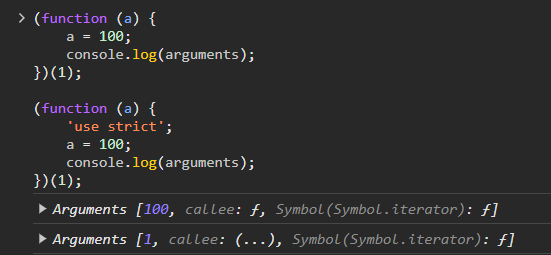

# 모딥다 20장 strict mode

## 20.1 strict mode란?

```js
function foo() {
	x = 10;
}
foo();

console.log(x); // 10
```

**암묵적 전역**
위 예제에서 변수 x는 어디서도 선언이 된 적이 없다. 하지만 콘솔에선 10이 출력되었다. 이는 자바스크립트 엔진이 변수 x를 찾지 못하면 암묵적으로 전역 객체의 프로퍼티로 동적으로 생성하여(`window.x`) 마치 전역 변수처럼 사용이 가능해지기 때문이다. 이러한 현상을 암묵적 전역이라고 한다.
이처럼 개발자의 의도와는 상관없이 발생한 암묵적 전역은 오류를 발생시키는 원인이 될 수 있으므로 반드시 var, let, const 키워드를 사용하여 변수를 선언한 다음 사용해야 한다.

**ES5 strict mode**
개발 환경에서 자바스크립트 문법을 엄격히 적용하고 명시적으로 에러를 발생시킴으로서 오타나 문법 지식의 미비로 발생할 수 있는 여러 오류의 가능성을 줄이기 위해 ES5에서 strict mode가 추가되었다.

## 20.2 strict mode의 적용

- `'use strict';`를 전역의 선두 또는 함수 몸체의 선두에 추가하면 strict mode가 적용된다.
- 전역이던 함수 몸체이던 코드의 선두에 추가하지 않으면 strict mode가 제대로 동작하지 않는다.
- 전역의 선두에 추가 : 스크립트 전체에 적용됨
- 함수 몸체의 선두에 추가 : 해당 함수와 중첩 함수에 적용됨

```js
// 전역에 strict mode 적용 - 스크립트 전체에 적용됨
'use strict';

function foo() {
	x = 10; // ReferenceError: x is not defined
}
foo();
```

```js
// 함수 몸체의 선두에서 strict mode 적용 - 해당 함수와 중첩 함수에 적용됨
function foo() {
	'use strict';

	x = 10; // ReferenceError: x is not defined
}
foo();
```

```js
// use strict가 코드의 선두에 위치하지 않으면 제대로 동작하지 않음
function foo() {
	x = 10; // 에러가 발생하지 않는다.
	('use strict');
}
foo();
```

## 20.3 전역에 strict mode를 적용하는 것은 피하자

전역에 적용한 strict mode는 스크립트 단위로 적용되기 때문에 strict mode인 스크립트와 non-strict mode인 스크립트를 혼용할 경우 오류를 발생시킬 수 있다.

외부 서드파티 라이브러리 사용 시 해당 라이브러리가 non-strict mode인 경우도 있기 때문에 전역에 strict mode를 적용하는 것은 바람직하지 않다.

strict mode는 즉시 실행 함수로 감싼 스크립트 단위로 적용하는 것이 바람직하다.

## 20.4 함수 단위로 strict mode를 적용하는 것도 피하자

어떤 함수는 strict mode를 적용하고 어떤 함수는 적용하지 않는 것은 바람직하지 않고 모든 함수에 일일히 적용하는 것도 번거로운 일이다.

그리고 strict mode가 적용된 함수가 참조할 함수 외부의 컨텍스트에 strict mode를 적용하지 않는 경우에도 문제가 발생할 수 있다.

따라서 strict mode는 즉시 실행 함수로 감싼 스크립트 단위로 적용하는 것이 바람직하다.

## 20.5 strict mode가 발생시키는 에러

- 발생시키는 에러
  1. 암묵적 전역 : `ReferenceError: x is not defined`
  2. 변수, 함수, 매개변수의 삭제 : `SyntaxError: Delete of an unqualified identifier in strict mode.`
  3. 매개변수 이름의 중복 : `SyntaxError: Duplicate parameter name not allowed in this context`
  4. with 문의 사용 : `SyntaxError: Strict mode code may not include a with statement`

## 20.6 strict mode 적용에 의한 변화

### 20.6.1 일반 함수의 this

기존에는 전역 객체가 바인딩되던 일반 함수의 this는 strict mode 적용 시 undefined가 바인딩된다. 이 때 에러는 발생하지 않는다.

### 20.6.2 arguments 객체



기존에는 매개변수에 전달된 인수를 함수 내부에서 재할당하여 변경해도 arguments 객체에 반영되었지만 strict mode에서는 arguments 객체에 반영되지 않는다.
